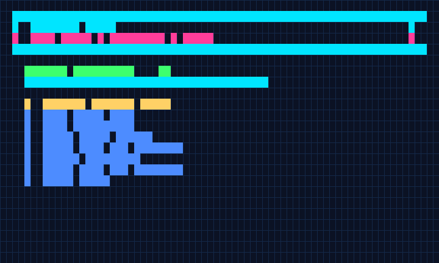

# Jankurai

<!-- jankurai-badge:start -->
[](agent/jankurai-badge.json)
<!-- jankurai-badge:end -->

[**Current release v1.7.0**](https://github.com/neverhuman/jankurai/releases/tag/v1.7.0)
· [CI](https://github.com/neverhuman/jankurai/actions/workflows/ci.yml)
· [AGENTS.md](AGENTS.md)

Jankurai audits repositories for unsafe changes, missing proof, unclear ownership,
and drift between code and its contracts. Use it locally or in CI to turn an
AI-assisted change into a reviewable report and repair queue.



The 1920×1080 lossless-palette recording is produced by the same CI script and
published as the `audit-demo-gifs` artifact (`docs/demo/audit-1080p.gif`).

## Family scores

First-party Jankurai score icons from each split-family repository. Each SVG is
generated by `jankurai badge` and committed in that repo.

| Repository | Score |
| --- | --- |
| [jankurai](https://github.com/neverhuman/jankurai) | [](agent/jankurai-badge.json) |
| [jankurai-core](https://github.com/neverhuman/jankurai-core) | [](https://github.com/neverhuman/jankurai-core) |
| [jankurai-standard](https://github.com/neverhuman/jankurai-standard) | [](https://github.com/neverhuman/jankurai-standard) |
| [jankurai-contracts](https://github.com/neverhuman/jankurai-contracts) | [](https://github.com/neverhuman/jankurai-contracts) |
| [jankurai-conformance](https://github.com/neverhuman/jankurai-conformance) | [](https://github.com/neverhuman/jankurai-conformance) |
| [jankurai-paper](https://github.com/neverhuman/jankurai-paper) | [](https://github.com/neverhuman/jankurai-paper) |
| [jankurai-deploy](https://github.com/neverhuman/jankurai-deploy) | [](https://github.com/neverhuman/jankurai-deploy) |
| [jankurai-tools-kernel](https://github.com/neverhuman/jankurai-tools-kernel) | [](https://github.com/neverhuman/jankurai-tools-kernel) |
| [jankurai-tools-analyzers](https://github.com/neverhuman/jankurai-tools-analyzers) | [](https://github.com/neverhuman/jankurai-tools-analyzers) |
| [jankurai-tools-dedup](https://github.com/neverhuman/jankurai-tools-dedup) | [](https://github.com/neverhuman/jankurai-tools-dedup) |
| [jankurai-tools-fleet](https://github.com/neverhuman/jankurai-tools-fleet) | [](https://github.com/neverhuman/jankurai-tools-fleet) |
| [jankurai-tools-guard](https://github.com/neverhuman/jankurai-tools-guard) | [](https://github.com/neverhuman/jankurai-tools-guard) |
| [jankurai-tools-proof](https://github.com/neverhuman/jankurai-tools-proof) | [](https://github.com/neverhuman/jankurai-tools-proof) |
| [jankurai-tools-tui](https://github.com/neverhuman/jankurai-tools-tui) | [](https://github.com/neverhuman/jankurai-tools-tui) |
| [jankurai-tools-ux](https://github.com/neverhuman/jankurai-tools-ux) | [](https://github.com/neverhuman/jankurai-tools-ux) |

## Install and run your first audit

Linux x86-64 and Apple Silicon macOS:

```sh
bash -o pipefail -c 'curl --proto "=https" --tlsv1.2 -fsSL https://raw.githubusercontent.com/neverhuman/jankurai/v1.7.0/jankurai-installer.sh | bash -s -- --tag v1.7.0'
export PATH="$HOME/.local/bin:$PATH"
jankurai --version
# jankurai 1.7.0
```

The installer verifies checksums, signatures, GitHub attestations, and embedded
provenance, then runs the binary before replacing an existing installation.
It downloads temporary, hash-pinned verification tools; Rust, Node.js, GitHub
login, and preinstalled verifiers are unnecessary.

Native Windows (including PowerShell and Git Bash), Intel macOS, Linux ARM64,
and Alpine/musl are not supported release targets. Source builds also require a
supported Unix platform; the older monolithic `cargo install --path crates/jankurai`
command does not apply to this split workspace.

From the repository you want to inspect:

```sh
jankurai audit . --mode advisory --json target/jankurai/repo-score.json --md target/jankurai/repo-score.md --repair-queue-jsonl target/jankurai/repair-queue.jsonl
```

Read `target/jankurai/repo-score.md` for findings and suggested repairs. Advisory
mode is a useful first pass; [audit modes](docs/install.md#audit-modes) describe enforcing
checks in CI. The [GitHub Action](action.yml) uses the same verified installer.

Binaries install to `~/.local/bin`. Add the PATH line above to your shell profile
if that directory is absent. Run the pinned install command again to upgrade or
reinstall. Remove the auditor with `rm ~/.local/bin/jankurai`.
See [installation options](docs/install.md) for a custom location and verification details.

## Optional TUI and UX tools

Install the TUI test CLI with the same verifier:

```sh
bash -o pipefail -c 'curl --proto "=https" --tlsv1.2 -fsSL https://raw.githubusercontent.com/neverhuman/jankurai/v1.7.0/jankurai-installer.sh | bash -s -- --tag v1.7.0 --product tuiwright'
tuiwright --version
# tuiwright 1.7.0
```

The release also includes the built `@jankurai/ux-qa` npm package for browser
geometry and accessibility checks. It requires Node.js and Playwright; follow
[UX installation](docs/install.md#ux-package) for package verification and browser setup.

## GitHub Action and local hooks

`action.yml` in this repository adds a configurable score floor. The immutable
`v1.7.0` Action metadata does not accept `fail-under` and must not be used as
an example of that gate. Pin a later hub commit, not `@v1.7.0`, until a
qualified release ships. Updated local hooks need a producer that supports
`--no-badge`. See [Action qualification](docs/action.md).

## Build from a fresh clone

Contributors need Git, Rust (pinned in `rust-toolchain.toml`), and Node.js 24:

```sh
git clone https://github.com/neverhuman/jankurai.git workspace/jankurai
cd workspace/jankurai
bash scripts/family.sh setup
bash scripts/family.sh build
```

This hub assembles 14 component repositories. Setup clones missing components
alongside it, verifies immutable tags against `family.lock`, and installs locked
Cargo/npm dependencies. No Jeryu service, Git rewrite, or existing cache is required.
Edit components in their canonical checkouts; `.fusion/` provides local build links.

| Shell command | Just recipe | Behavior |
| --- | --- | --- |
| `bash scripts/family.sh setup` | `just setup` | Bootstrap components and project dependencies at the accepted lock. |
| `bash scripts/family.sh pull` | `just pull` | Fetch successful component revisions, test a candidate in a disposable CI checkout, and update the two locks only after success. |
| `bash scripts/family.sh build` | `just build` | Build the auditor, Tuiwright CLI, and UX CLI; bootstrap missing components while preserving existing heads. |
| `bash scripts/family.sh check` | `just check` | Run component checks, combined Rust/UX tests, conformance, security, and audit evidence. |
| `bash scripts/family.sh status` | `just status` | Show branches, commits, dirty files, and differences from the accepted lock. |

Full checks also require Chromium, TeX/latexmk, nextest, and the security tools
installed explicitly in `.github/workflows/ci.yml` and `ops/ci/github-setup.sh`.
Normal Cargo builds use the committed aggregate `Cargo.lock` with `--locked`.
The legacy `scripts/fuse.sh --source github --all` and `.fusion/dev.sh` entrypoints
remain compatibility wrappers.

## Work preservation

Setup and pull reject dirty checkouts or changes that would discard ahead or
divergent commits. Obtain a stopped-head handoff before changing a busy checkout.
No command creates Git worktrees. Candidate integration uses an automatically
removed standalone CI checkout; failed candidates leave accepted locks unchanged.

## Releases and updates

[Release and installation details](docs/release.md) describe Linux x86-64 and
Apple Silicon macOS tarballs for `jankurai` and `tuiwright`, plus the built UX CLI
npm package. The governed launcher and demo binary are not public assets.

[Automation](docs/github-automation.md) explains immutable CI tags, hourly lock
update PRs, exact-revision merge checks, and automation-token rotation.
All default branches require protected PR merges and `<repo>/required`.
Historical Jeryu branches, dependency tags, and the hub's legacy GitHub history
are preserved; public builds use GitHub exclusively.
